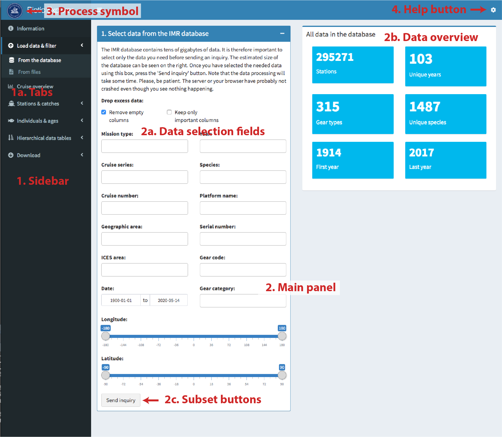

```{r, echo = FALSE}
knitr::opts_chunk$set(
  collapse = TRUE,
  message = FALSE,
  warning = FALSE,
  comment = "#>",
  fig.path = "man/figures/README-"
)
```

# Biotic Explorer
**A Shiny app to explore Biotic data within the Institute of Marine Research Norway (IMR) database. Version `r scan("VERSION", what = "character", quiet = TRUE)`.**

**Biotic Explorer** is a [Shiny](https://shiny.rstudio.com/) app for examining and manipulating Norwegian Maritime Data Center (NMD) standard Biotic XML files and the IMR Biotic database. It operates in two modes:

- **File mode** — open local NMD Biotic v3 XML files directly from your computer, no database required.
- **Database mode** — connect to a DuckDB database compiled by [BioticExplorerServer](https://github.com/DeepWaterIMR/BioticExplorerServer) to query the full IMR Biotic dataset. The database must be installed to the [default location (`~/IMR_biotic_BES_database`)](https://github.com/DeepWaterIMR/BioticExplorerServer?tab=readme-ov-file#download-the-imr-biotic-database) for BioticExplorer to detect it automatically at startup.

## The server version

There is currently no server version of Biotic Explorer running. Run it locally on your computer by following the instructions below.

## Installation of the desktop version

The app requires [R](https://www.r-project.org/) and [RStudio / Posit](https://posit.co/). Install these following the instructions on their respective websites. Then install the [Shiny](https://shiny.rstudio.com/) package in R:

```{r eval = FALSE}
install.packages("shiny")
```

Running the app for the first time **automatically installs and loads** all required packages. If you encounter installation problems, read the error messages carefully or contact the app maintainer.

### Running the app from your hard drive

Click the green **Code** button on GitHub → **Download ZIP**. Extract the ZIP to a desired location, open `app.R` in RStudio, and [click **Run App**](https://shiny.rstudio.com/tutorial/written-tutorial/lesson1/).

### Running the app directly from GitHub

You may also run the app directly from GitHub without downloading it first:

```{r eval = FALSE}
library(shiny)
shiny::runGitHub("BioticExplorer", "DeepWaterIMR")
```

## Usage

The Biotic Explorer interface consists of the sidebar, main panel, process symbol, and help button (Figure 1). The sidebar consists of tabs. The main panel consists of different elements depending on the active tab. The data interface consists of data selection fields, a data overview, and subset buttons.

```{r, fig.cap=cap, echo = FALSE}

cap <- "Figure 1. The Biotic Explorer interface consists of the sidebar (1), main panel (2), process symbol (3), and help button (4). The sidebar consists of tabs (1a). The main panel consists of different elements depending on tab selection. The data interface consists of data selection fields (2a), data overview (2b), and subset buttons (2c)."
```

The process symbol has two states: the IMR logo and a *BUSY* icon (Figure 2). The *BUSY* icon means the app is processing data — avoid clicking tabs, boxes, or buttons while this is active. Note that internal R processing and GUI rendering are separate steps, so it may take a moment for the app to become responsive after the *BUSY* symbol disappears.

```{r, echo=FALSE, out.width="20%",fig.cap=cap,fig.show='hold'}
knitr::include_graphics(c("www/logo.png","www/logo_bw.png"))
cap <- "Figure 2. Process symbol states. The app is ready when the IMR logo is shown (left). The app is busy when the BUSY icon is shown (right). Avoid clicking anything while the app is busy."
```

### Read data

#### Download data from the database

Click **Load data & filter → From the database**. Use the filter controls to narrow down the dataset, then click **Send inquiry**. The BUSY symbol disappears when the operation is done — this may take time for large selections. An overview of the selected data and station positions is shown on the right. You can further narrow the selection with the **Subset** button, or return to the full database selection with **Reset**.

#### Read NMD Biotic XML files

Click **Load data & filter → From files → Browse..** and select one or more `.xml` files from your computer. An overview and station map appear below. Use the **Filter data by** fields to select the data you want to keep and click **Subset**. The **Reset** button restores the full loaded dataset.

#### Resume a previous session

Click **Load data & filter → From files → Browse..** and open an `.rds` file previously saved from BioticExplorer (see [Export data](#export-data)). The session resumes with all data and filter selections intact.

### Examine data

#### Cruise overview

The **Cruise overview** tab shows all cruises (the `mission` element of NMD Biotic files) in a searchable table.

#### Stations & catches

The **Stations & catches** section contains three tabs:

- **Overview** — summary plots of catch composition, catch weights, gear types, and station depths derived from the `fishstation` and `catchsample` elements.
- **Map of catches** — interactive leaflet map of catch weight per station, with a species selector and a catch composition map.
- **Examine data** — the full merged station and catch dataset in a searchable table.

#### Individuals & ages

The **Individuals & ages** section contains three tabs:

- **Overview** — length and weight distribution plots across all species with sufficient data, plus a summary table of measurement counts per species.
- **Species plots** — life-history plots for a selected species: length–weight relationship, age–length growth model, L50 maturity, sex ratio map, geographic size distribution, sex-specific length distribution, and stage-specific length distribution. Plots appear only when enough data are available.
- **Examine data** — the full merged individual and age dataset in a searchable table.

#### Hierarchical data tables

The **Hierarchical data tables** section exposes the raw NMD Biotic elements (`fishstation`, `catchsample`, `individual`, `agedetermination`) in their original tabular form without the cross-table merging applied in the other views.

### Download

#### Export data

Use the **Download → Data** tab to export the current session. To reopen the data in BioticExplorer or in R, choose **R** format — this saves an `.rds` file readable with [`readRDS()`](https://stat.ethz.ch/R-manual/R-devel/library/base/html/readRDS.html). Data can also be exported as ZIP-compressed CSV files or as a multi-sheet Excel workbook.

#### Export figures

Use the **Download → Figures** tab to export any combination of figures as PNG, JPEG, or PDF. The following figure groups are available:

- **Station overview figures** — species composition, summed/mean/range catch weights, mean specimen weight, catch counts, gear-type catch totals, station depth, and fishing depth by species.
- **Station maps** — total catch map (by species or all species combined) and catch composition pie-chart map.
- **Individual overview** — length and weight distributions across all species with sufficient measurements.
- **Species-specific figures** — select a species from the dropdown to export any of: length–weight relationship, age–length growth curve (von Bertalanffy, Gompertz, or Logistic), 50% maturity at length (L50), sex ratio map, geographic size distribution map, sex-specific length distribution, and stage-specific length distribution. Figures for which the selected species lacks sufficient data are silently skipped.

Leaflet map figures are rendered as static images via `mapview`. To modify figures beyond the options offered in the app, [download BioticExplorer](https://github.com/DeepWaterIMR/BioticExplorer) and edit `R/figure_functions.R`.

## Contributions and contact information

Contributions are welcome. Please contact the app maintainer Mikko Vihtakari (<mikko.vihtakari@hi.no>) to discuss ideas or report issues, or open an issue on the [GitHub repository](https://github.com/DeepWaterIMR/BioticExplorer).

## Dependencies

The app automatically installs the following packages on first run:

- [shiny](https://cran.r-project.org/web/packages/shiny/index.html): The Shiny web application framework.
- [shinydashboard](https://cran.r-project.org/web/packages/shinydashboard/index.html): Dashboard layout for Shiny.
- [bsplus](https://cran.r-project.org/web/packages/bsplus/index.html): Bootstrap extensions for tooltips and collapsible panels.
- [shinyFiles](https://cran.r-project.org/web/packages/shinyFiles/index.html): File up- and download utilities for Shiny.
- [DT](https://cran.r-project.org/web/packages/DT/index.html): Interactive data tables.
- [data.table](https://cran.r-project.org/web/packages/data.table/index.html): Fast in-memory data manipulation.
- [dtplyr](https://cran.r-project.org/web/packages/dtplyr/index.html): dplyr syntax for data.table objects.
- [tidyverse](https://cran.r-project.org/web/packages/tidyverse/index.html): Data manipulation and plotting (dplyr, ggplot2, tidyr, etc.).
- [RstoxData](https://github.com/StoXProject/RstoxData): Reads NMD Biotic XML files.
- [leaflet](https://cran.r-project.org/web/packages/leaflet/index.html): Interactive maps.
- [leaflet.minicharts](https://cran.r-project.org/web/packages/leaflet.minicharts/index.html): Pie-chart and bar-chart markers for leaflet maps.
- [mapview](https://cran.r-project.org/web/packages/mapview/index.html): Renders leaflet maps to static image files for download.
- [plotly](https://cran.r-project.org/web/packages/plotly/index.html): Interactive plots.
- [openxlsx](https://cran.r-project.org/web/packages/openxlsx/index.html): Writes Excel files.
- [scales](https://cran.r-project.org/web/packages/scales/index.html): Axis scaling helpers for ggplot2.
- [fishmethods](https://cran.r-project.org/web/packages/fishmethods/index.html): Fits growth models (von Bertalanffy, Gompertz, Logistic).
- [viridis](https://cran.r-project.org/web/packages/viridis/index.html): Viridis colour scales for size distribution maps.
- [DBI](https://cran.r-project.org/web/packages/DBI/index.html): Database interface.
- [duckdb](https://cran.r-project.org/web/packages/duckdb/index.html): DuckDB driver for the BioticExplorer database.
- [devtools](https://cran.r-project.org/web/packages/devtools/index.html): Used to install packages not available on CRAN.

## News

2026-05-19 Bumped to version 0.8.0. Introduced `all.x = TRUE` merge for stations without catch (empty-catch stations now retained with `commonname = NA`). Bug fixes and completed figure download. Fixed download format detection, file-mode mission type filter, database-mode column existence guards, cruise series label lookup, and several smaller issues. All figure types in Download → Figures are now fully functional. Git repository moved to [DeepWaterIMR](https://github.com/DeepWaterIMR/BioticExplorer).

2025-01-21 Migrated BioticExplorer to [DuckDB](https://duckdb.org/docs/api/r.html). The app now works on all commonly used operating systems.

2020-05-13 Added complete database support. All planned features incorporated; bug-fixing and polish remain.

2020-01-22 Update preparing for beta-release. Many new features. Unstable and undocumented.

2019-07-11 Fixed Windows-related problems. The app should work on most institutional machines.

2019-07-08 First alpha version uploaded. Works but incomplete; intended for internal testing.
